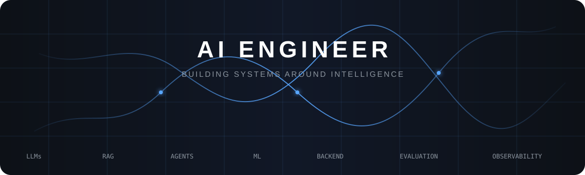
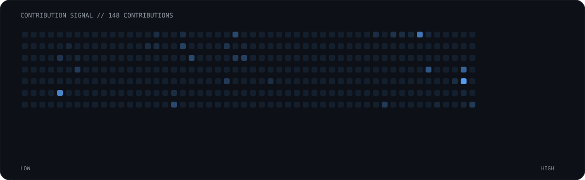
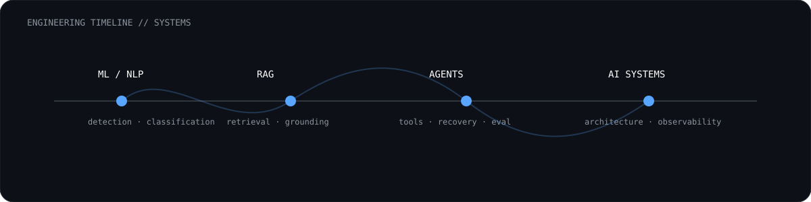
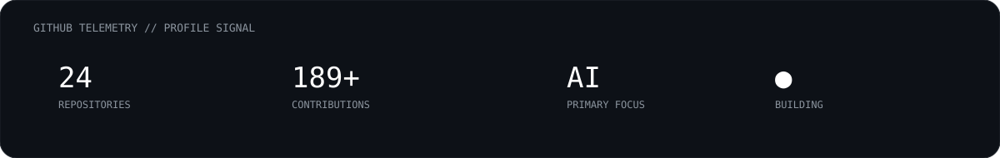

<div align="center">



<br>

<a href="https://github.com/Prathmesh-2023?tab=repositories"></a>
&nbsp;
<a href="https://www.linkedin.com/"></a>

<br><br>


</div>

---

## `01 // SYSTEM`

<table><tr><td width="60%" valign="top">

### AI / LLM ENGINEER

I build systems around intelligence.

My work focuses on the layer between a model and a useful product:

**LLMs · RAG · Agents · ML · Backend**

I am particularly interested in structured extraction, retrieval, evaluation, observability, and failure recovery.

</td><td width="40%" valign="top">

```text
SYSTEM STATUS

LLM ENGINEERING   ●
RAG SYSTEMS       ●
AGENT SYSTEMS     ●
MACHINE LEARNING  ●
BACKEND           ●

STATE: BUILDING
```

</td></tr></table>

---

## `02 // ACTIVITY // NEURAL SIGNAL`

<div align="center">

</div>

> **The graph is generated from GitHub activity. The activity becomes the visualization.**

---

## `03 // CURRENT SYSTEMS`

<table><tr><td width="50%" valign="top">

### `POLARIS`

**AI Policy Intelligence Studio**

`RAG` `ML` `Causal Inference` `LLMs`

A policy intelligence system combining evidence retrieval, modelling, scenarios, and explainable AI insights.

<a href="https://github.com/Prathmesh-2023/POLARIS-AI-Policy-Intelligence-Studio">→ repository</a>

</td><td width="50%" valign="top">

### `CONNECT4 // AGENT ARENA`

**Multi-agent LLM evaluation**

`GPT-OSS` `Llama` `Groq` `FastAPI` `React`

Agents compete in Connect 4 while the system tracks moves, blunders, ELO, telemetry, and recovery.

<a href="https://github.com/Prathmesh-2023/agent-arena-main">→ repository</a>

</td></tr><tr><td width="50%" valign="top">

### `DOCUMENT INTELLIGENCE`

**Retrieval-first LLM applications**

`FAISS` `Embeddings` `RAG` `LLMs`

Exploring reliable context construction, retrieval, and grounded generation.

</td><td width="50%" valign="top">

### `LEGAL RAG`

**Evidence-grounded document Q&A**

`FAISS` `Sentence Transformers` `PyMuPDF` `LLaMA`

Document retrieval and answer generation with a focus on grounded responses.

</td></tr></table>

---

## `04 // SYSTEM MAP`

<div align="center">

```text
                         ┌───────────────┐
                         │     MODEL     │
                         │   LLM / ML   │
                         └───────┬───────┘
                                 │
                                 ▼
                    ┌───────────────────────┐
                    │       CONTEXT         │
                    │   RAG · MEMORY · DB   │
                    └───────────┬───────────┘
                                │
                                ▼
                    ┌───────────────────────┐
                    │       REASONING       │
                    │    AGENTS · TOOLS     │
                    └───────────┬───────────┘
                                │
                                ▼
                    ┌───────────────────────┐
                    │       VALIDATION      │
                    │   SCHEMAS · GUARDS    │
                    └───────────┬───────────┘
                                │
                                ▼
                    ┌───────────────────────┐
                    │        SYSTEM         │
                    │  API · EVAL · LOGGING │
                    └───────────────────────┘
```

</div>

> **The model is one component. The system is the product.**

---

## `05 // ENGINEERING LOG`

<details><summary><b>01 · Reliable structured extraction</b></summary><br>LLM output is not application state. <code>extract → validate → safely update → transition</code>. Invalid output should fail without corrupting valid state.</details>

<details><summary><b>02 · RAG is more than vector search</b></summary><br>Chunking, embeddings, retrieval quality, context construction, and evaluation all influence the final answer.</details>

<details><summary><b>03 · Agents need recovery</b></summary><br>Real agents encounter invalid tool calls, unexpected states, and malformed outputs. Recovery is part of the system.</details>

<details><summary><b>04 · Observability matters</b></summary><br>A useful AI system should let you trace <code>input → retrieval → model → validation → state → response</code>.</details>

---

## `06 // STACK`

<div align="center">

<br><br>
<code>LLMs</code> · <code>RAG</code> · <code>FAISS</code> · <code>Sentence Transformers</code> · <code>LangChain</code> · <code>Groq</code>
</div>

---

## `07 // ENGINEERING TIMELINE`

<div align="center"></div>

---

## `08 // GITHUB TELEMETRY`

<div align="center">

<br><br>


</div>

---

<div align="center">

<br><br>
`BUILD → MEASURE → BREAK → IMPROVE`
</div>
